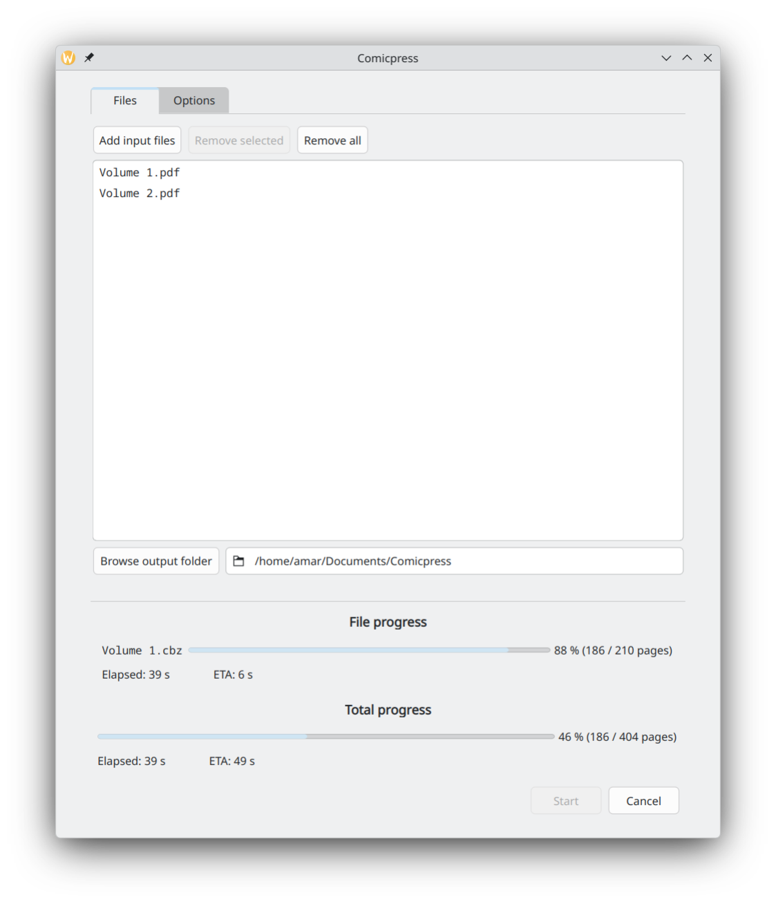

# Comicpress

Comicpress is an application that optimizes comics and manga for ereaders. It accepts CBR, CBZ, and PDF files as input formats, and converts them to optimized CBZ files. The two primary benefits of using Comicpress are that it sharply decreases file sizes while also significantly improving perceived quality. Comicpress applies image processing operations such as contrast stretching, high-quality scaling, quantization, and dithering to significantly improve the perceived quality on ereaders. These settings can customized or disabled. Comicpress also downscales pages to your specific ereader device’s display resolution, which not only significantly decreases file sizes but also likely improves the perceived quality on the ereader due to the high-quality default resampler (Magic Kernel Sharp 2021). _Comicpress compresses comics and mangas to approximately one quarter of their original size on average._

## Comparison to KCC

Comicpress is similar to [KCC](https://github.com/ciromattia/kcc), but different in important ways:

- Comicpress supports more ereader devices for setting the display preset.
- When PDF files are used as input files, the final files produced by Comicpress are higher quality than those produced by KCC. This is because Comicpress lets you customize the pixel density, and a high value of 1200 PPI is used as the default. On the other hand, KCC always rasterizes PDFs at a pixel density dependent on the target and page heights, which usually results in lower pixel density values.
- KCC uses Pillow to process images, whereas Comicpress uses pyvips. pyvips is slightly faster, but most importantly it supports more features and image formats (see below).
- In addition to the widely used JPEG and PNG image formats, Comicpress supports AVIF, JPEG XL, and WebP for pages. WebP results in noticeably smaller files than PNG and is supported by KOReader.
- Comicpress’s image processing operations are more customizable than in KCC. Scaling, quantization, and dithering can easily be adjusted or turned off.
- Comicpress generally has an easier-to-use user interface than KCC.
- There are a few features present in KCC that are not in Comicpress, such as automatically cropping out margins.

## Licence

- All of the code written by the authors and contributors of this project is
  released under [CC0](Licence.txt).
- However, this project depends on PyMuPDF, which is licensed under the AGPL.
- Therefore, any distributed version of this project that includes PyMuPDF is
  licensed under the [AGPL v3](Licence-AGPL.txt).
